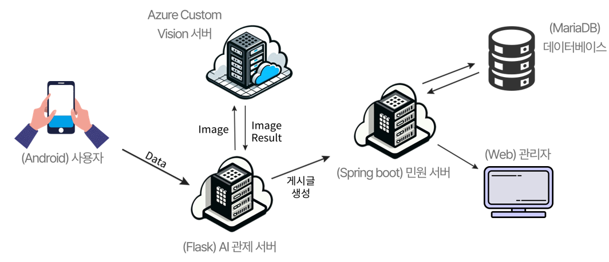

## 1. 프로젝트 소개
민원을 쉽고 간편하게! 민원고
민원고는 길거리 보도 불편사항을 간편하게 사진만 촬영하면 자동으로 민원을 신고해주는 서비스 입니다.
 

## 2. 팀원 소개 (한국 폴리텍 대학교 서울 정수 캠퍼스 인공지능 소프트웨어과)

| 이름     | 역할                | 기술 스택                                                                                                                                           | 소개                                                                                                      | 
|:---------|:--------------------|:---------------------------------------------------------------------------------------------------------------------------------------------------|:---------------------------------------------------------------------------------------------------------|
| [나예은](https://github.com/yeeun03030) | 팀원                |        | 앱 개발 담당   Spring Boot 기반 민원 서버 제작   Thymeleaf를 활용한 Spring Boot 프론트엔드 구현   발표자료 작성 및 PPT 제작|
| [유승호](https://github.com/00seungho) | 팀원                |           | Flask 기반 AI 관제 서버 개발   Azure 커스텀 비전 모델 훈련   Spring Boot REST API 통신 구축   Azure 서버 환경 설정   프로젝트 아키텍처 설계 |

## 3. 개요
- **프로젝트 이름**: 민원고
- **구축 서버**: 

- **OS**: 
- **개발 언어**:   
- **개발 프레임워크**:   
- **서버**:   

## 4. 구현 일정

| 구분 | 추진 내용 | 추진 일정 | 1주 |
|------|-----------|-----------|-----|
| 실행 | 구축     |           | ■   |
| 실행 | 개발     |           | ■   |
## 5. 서버 아키텍쳐 설계

## 6. 구현 핵심 기술
### Azure Custom Vison
- Object Dection 모델 제작
- RestAPI 형태의 엔드포인트 지원으로 손쉬운 추론

### Spring Boot 관리자 서버
-   Spring boot 사용하여 RESTful API 서버 개발
-   SpringSecurity를 사용하여 사용자 인증 및 권한 관리
-   세션기반의 인증으로 인증절차 간소화

### Flask 기반 AI관제 서버
-   Azure Custom Vison에 이미지 전송을 위한 전처리
-   사용자의 위치정보를 받아 KaKao 지도 API를 이용해 행정구역 반환

## 5. 시현 내용
유튜브 링크

